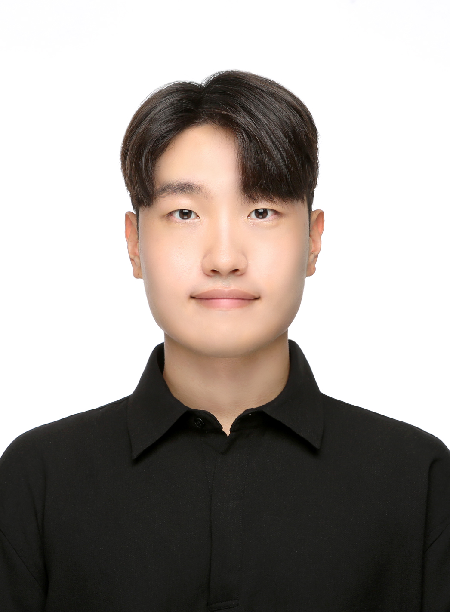
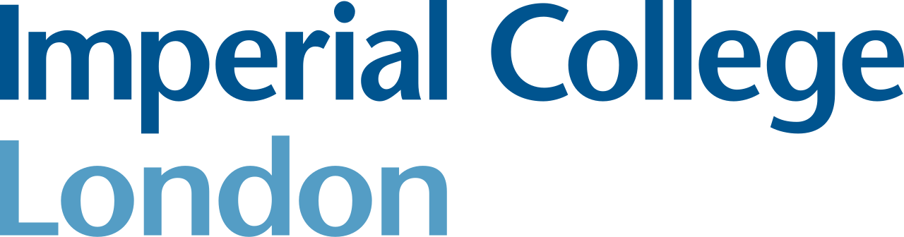
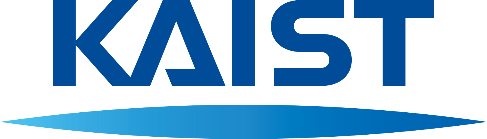
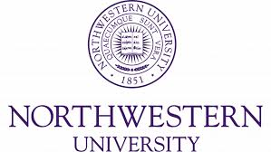

  
<h1 class="hero-name">Junkil Park</h1>

AI for materials discovery and inverse design

## Research Interests

- Artificial Intelligence for Materials Discovery
- Materials Inverse Design using Generative Models
- Molecular Simulation and Computational Chemistry

<h2>Experience</h2>

Imperial College London

Present

Research Associate (2026.05 – )

Advisor: Prof. Aron Walsh

London, United Kingdom

Seoul National University

2024–2026

Postdoctoral Researcher (2024.09 – 2026.04)

Advisor: Prof. Yousung Jung

Seoul, South Korea

Korea Advanced Institute of Science and Technology

2021–2024

Ph.D. (2021.03 – 2024.09)

Advisor: Prof. Jihan Kim

Daejeon, South Korea

Northwestern University

2022–2023

Visiting Researcher (2022.08 – 2023.01)

Advisor: Prof. Randall Q. Snurr

Illinois, United States

## Links

- Email: [junkil0617@gmail.com](mailto:junkil0617@gmail.com)
- [Google Scholar](https://scholar.google.com/citations?user=rVGLAYIAAAAJ&hl=en)
- [LinkedIn](https://www.linkedin.com/in/junkil-park-108b952b5)
- [GitHub](https://github.com/parkjunkil)

