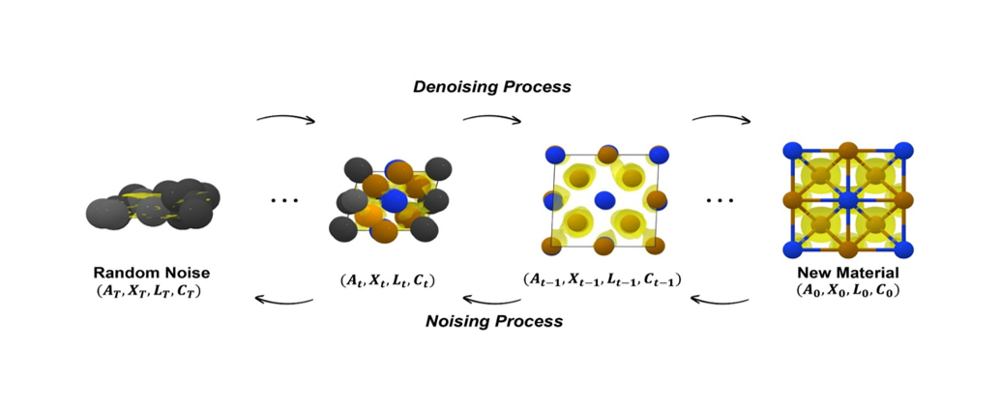
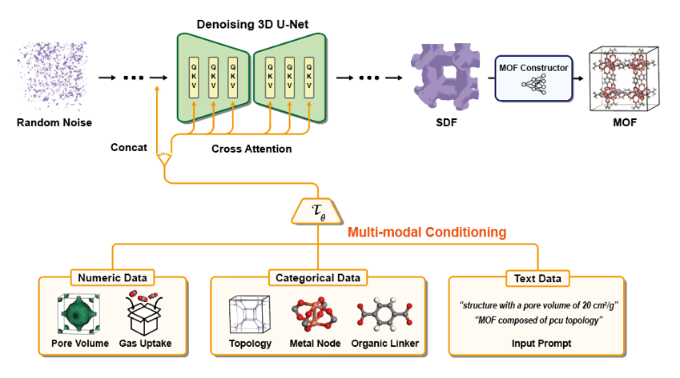
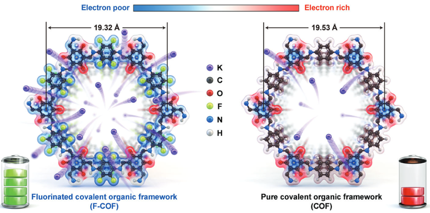
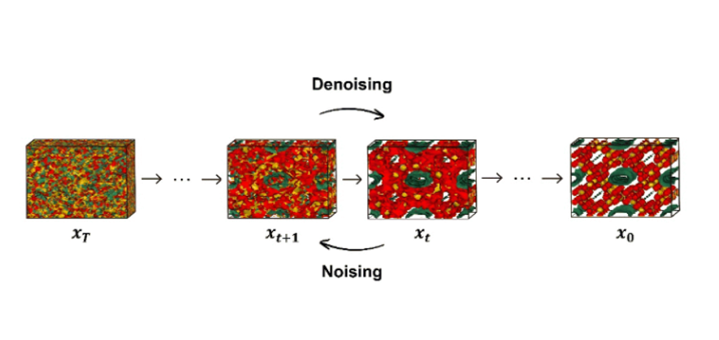
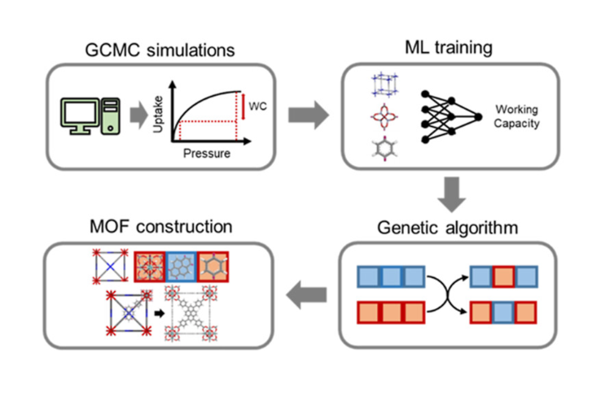

## Research

My research focuses on AI-driven materials discovery, with a particular emphasis on inverse design using generative models. I am also interested in MLIPs, agentic AI, and computational simulations including DFT and MD.

## Current Featured Projects

<a class="research-card-link" href="https://arxiv.org/abs/2511.14228" target="_blank">

ChargeDIFF (Nature Communications, 2026)

Inverse Design
Diffusion Models
Generative AI

</a>

<a class="research-card-link" href="https://www.nature.com/articles/s41467-024-55390-9" target="_blank">

MOFFUSION (Nat. Commun., 2025)

Inverse Design
Diffusion Models
Generative AI

</a>

<a class="research-card-link" href="https://advanced.onlinelibrary.wiley.com/doi/full/10.1002/aenm.202300442" target="_blank">

F-COF for K+ Ion Battery (Adv. Energy Mater., 2023)

Density Functional Theory
Electronic Structure

</a>

<a class="research-card-link" href="https://pubs.rsc.org/en/content/articlehtml/2024/ta/d3ta06274k" target="_blank">

ZeoDIFF (J. Mater. Chem. A, 2024)

Inverse Design
Diffusion Models
Generative AI

</a>

<a class="research-card-link" href="https://pubs.acs.org/doi/full/10.1021/acs.chemmater.2c01822" target="_blank">

Genetic Algorithm for MOFs (Chem. Mater., 2023)

Inverse Design
Genetic Algorithm
GCMC Simulation

</a>

